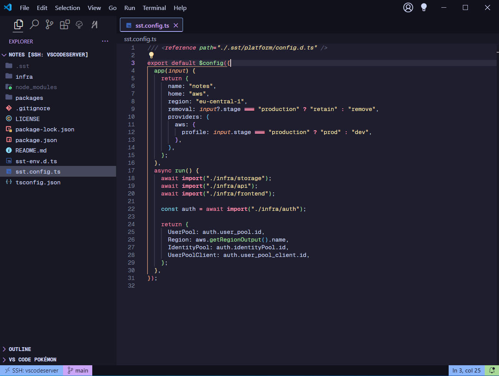
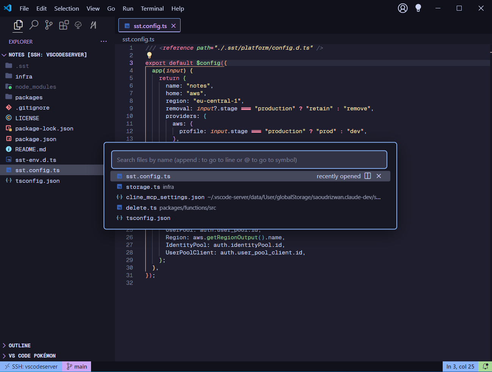

## configs

### vscode
- Font: Geist Mono
- Theme: Catppuccin (dooez)
- CSS modifications made directly to vscode without extensions at the `C:\Users\%USERPROFILE%\AppData\Local\Programs\Microsoft VS Code\resources\app\out\vs\workbench` path in the file `workbench.desktop.main` 

